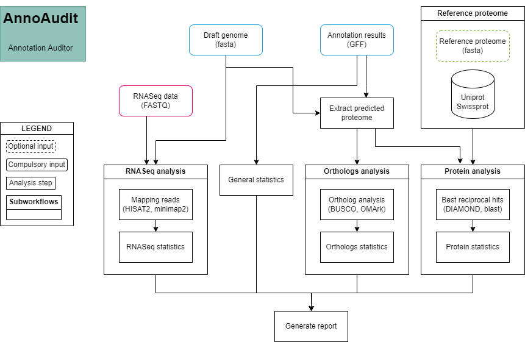

# AnnoAudit - Annotation Auditor

AnnoAudit is a robust Nextflow pipeline designed to evaluate the quality of genomic annotations through a multifaceted approach.

## Overview of the workflow


### Input data

- Reference genome `genome.[.fna, .fa, .fasta]`
- Annotation output `annotation.gff`
- RNAseq data listed in a metadata csv file. Input type can be mixed between long and short reads, with the option of single-end read. The input file should follow the format below:

```
sample_id,R1_path,R2_path,read_type
SAM1,/path/to/R1,,long             # For long reads
SAM2,/path/to/R1,/path/to/R2,short # For PE reads
SAM3,/path/to/R1,,short            # For SE reads
```

- Protein reference data in `fasta` format for evaluation, if not given, then the `Uniprot-SwissProt` will be downloaded and used.

### Pipeline steps



The main pipeline is divided into five different subworkflows.
- `General statistics`: Calculate the statistics obtained from the GFF file.
- `RNASeq analysis`: Map the RNASeq data to the genome (or with provided mapping bam file) to generate exon, intron, transcript coverage.
- `Ortholog analysis`: Compare the predicted proteome to known database using BUSCO and OMArk (OMA database).
- `Protein analysis`: Blast the predicted proteome to a known database (could be of relative species) to obtain best reciprocal hits (BRH), then generate statistics based on the BRH results.

### Output data

- Output text file contain the statistic calculated from the input `GFF` file: 
  - General statistics
  - BUSCO
  - OMArk
  - Best reciprocal hits
  - RNASeq analysis

## Prerequisites

The following programs are required to run the workflow and the listed version were tested. 

`nextflow v23.04.0 or higher`

`singularity`

`docker` (have not been tested but in theory should work fine)

## Installation

Simply get the code from github or workflowhub and directly use it for the analysis with `nextflow`.

```
git clone https://github.com/phuongdoand/ERGA-pipelines/tree/main/annotation/annotation_assessment
```

## Running AnnoAudit

### Before running the pipeline (IMPORTANT)

One thing with Nextflow is that it is running off a Java Virtual Machine (JVM), and it will try to use all available memory for Nextflow even though it is unnecessary (for workflow management and job control). This will cause much trouble if you run a job on an HPC cluster. Thus, to minimize the effect of it, we need to limit the maximum memory the JVM can use.

```
export NFX_OPTS="-Xms=512m -Xmx=3g"
```

`-Xms` is the lower limit, which is set as 512 MB.
`-Xmx` is the upper limit, which in this case is set as 3 GB.
Please modify this according to your situation.

### How to run the code

```
nextflow run main.nf --genome genome.fasta \
      --gff annotation.gff3 \
      --rnaseq metadata.csv \
      --outdir OUTDIR_NAME \
      --rm -resume
```

### Other parameters for running the analysis

```
Compulsory input:
--genome                       Draft genome fasta file contain the assembled contigs/scaffolds
--gff                          Annotation file that need to be evaluated
--genome_bam                   BAM file contain the mapped information from the RNASeq to the genome FASTA.
--rnaseq                       A CSV file following the pattern: sample_id,R1_path,R2_path,read_type.

Optional input:
--protein                      Fasta file containing translated protein sequences from the GFF for running evaluation.
                               If not specified, the workflow will automatically extract it from the `genome` and `gff`
--ref_protein                  Fasta file containing the reference protein sequences to be used for evaluation.
                               Ideally this should come from the same species and/or closely related species. If not provided
                               the Uniprot SwissProt data will be downloaded and used.
--lineage                      Lineage information providing for BUSCO, if not provided, the `--auto-lineage` option will be used
                               instead. Example: eudicots_odb10
--oma_database                 Pathway to the OMA database, if not specified, the workflow will download it automatically.
--run_blast                    If specify, will use `blast` for running best reciprocal hits instead of DIAMOND. [default: false]

Output option:
--outdir                       Output directory. 
--tracedir                     Pipeline information. 
--publish_dir_mode             Option for nextflow to move data to the output directory. [default: copy]
--tmpdir                       Database directory. 

Execution/Engine profiles:
The pipeline supports profiles to run via different Executers and Engines e.g.: -profile local,conda

Executer (choose one):
  local
  slurm

Engines (choose one):
  docker
  singularity
  apptainer

Per default: -profile slurm,singularity is executed.
```

## Example output

Below is the sample output of this workflow

```
|General Statistics        | Value                |
---------------------------------------------------
|num_genes                 | 41048                |
|num_genes_without_introns | 14365 (0.35%)        |
|mean_gene_length          | 2444.24              |
|median_gene_length        | 1613.0               |
|mean_exons_per_gene       | 4.26                 |
|median_exons_per_gene     | 2.0                  |
|mean_cds_length           | 1109.73              |
|median_cds_length         | 894.0                |
|total_cds_length          | 45552283             |
|percentage_cds_coverage   | 12.2%                |
|num_introns               | 133989               |
|mean_intron_length        | 408.83               |
|median_intron_length      | 147.0                |
|num_short_intron_<120_3n  | 18644 (33.06%)       |
|num_short_intron_<120_3n1 | 18876 (33.47%)       |
|num_short_intron_<120_3n2 | 18876 (33.47%)       |
|num_long_intron_>120_3n   | 26136 (33.68%)       |
|num_long_intron_>120_3n1  | 25866 (33.34%)       |
|num_long_intron_>120_3n2  | 25591 (32.98%)       |

|BUSCO                     | Value                |
---------------------------------------------------
|lineage_dataset           | eudicotyledons_odb10 |
|complete                  | 86.7%                |
|single_copy               | 70.5%                |
|multi_copy                | 16.2%                |
|fragmented                | 0.7%                 |
|missing                   | 12.6%                |
|num_markers               | 2326                 |
|domain                    | eukaryota            |

|OMARK                     | Value                |
---------------------------------------------------
|num_conserved_hogs        | 15089                |
|single                    | 11657 (77.25%)       |
|duplicated                | 3012 (19.96%)        |
|duplicated_unexpected     | 2775 (18.39%)        |
|duplicated_expected       | 237 (1.57%)          |
|missing                   | 420 (2.78%)          |
|num_proteins_in_proteome  | 41044                |
|total_consistent          | 34692 (84.52%)       |
|consistent_partial_hits   | 1998 (4.87%)         |
|consistent_fragmented     | 2014 (4.91%)         |
|total_inconsistent        | 2329 (5.67%)         |
|inconsistent_partial_hits | 624 (1.52%)          |
|inconsistent_fragmented   | 1423 (3.47%)         |
|total_contaminants        | 0 (0.00%)            |
|contaminants_partial_hits | 0 (0.00%)            |
|contaminants_fragmented   | 0 (0.00%)            |
|total_unknown             | 4023 (9.80%)         |

|Best Reciprocal Hits      | Value                |
---------------------------------------------------
|num_best_reciprocal_hits  | 9167                 |
|num_splitting_genes_08    | 1180 (12.87%)        |
|num_splitting_genes_05    | 0 (0.0%)             |
|num_fusion_genes_12       | 360 (3.93%)          |
|num_fusion_genes_15       | 286 (3.12%)          |
|KL_divergence_normed      | 0.1286               |
|JS_divergence_normed      | 0.0223               |
|KL_divergence_raw         | 0.1286               |
|JS_divergence_raw         | 0.0223               |


|RNASeq                    | Value                |
---------------------------------------------------
|num_unsupported_gene      | 10133 (24.69%)       |
```

## Performance of the workflow on assessing annotation

To be added

## Future work

To be added
