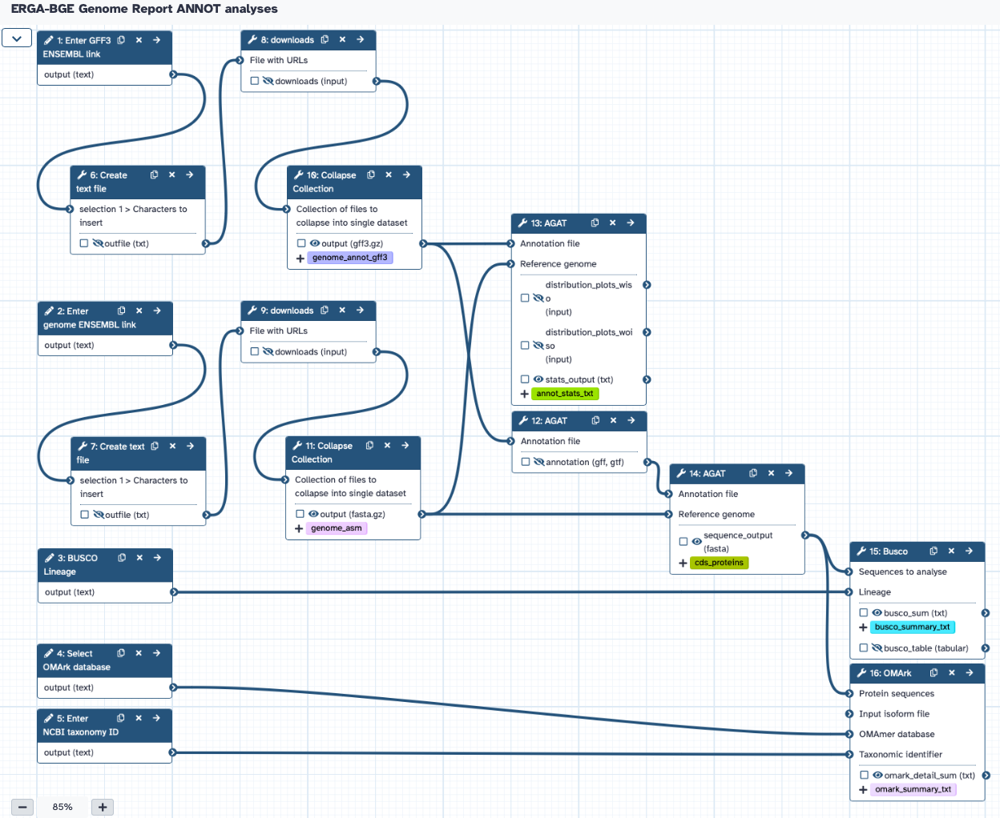

# Annotation Evaluation for ERGA-BGE Reports
The workflow takes the ENSEMBL link address of the annotation GFF3 file, the ENSEMBL link address of the assembly FASTA file, the NCBI taxonomy ID, and the selected BUSCO lineage and OMArk database to produce statistics of the annotation based on AGAT, BUSCO and OMArk.

