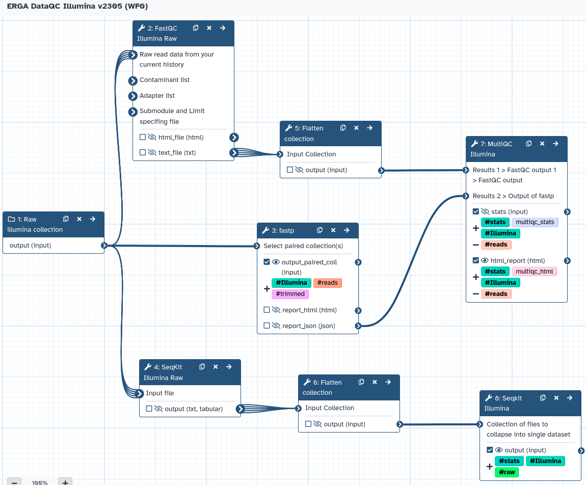
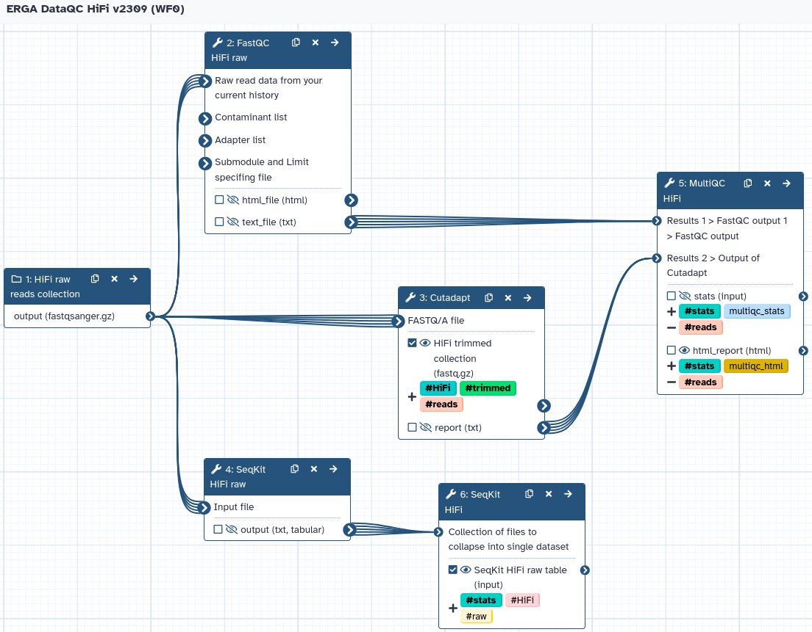
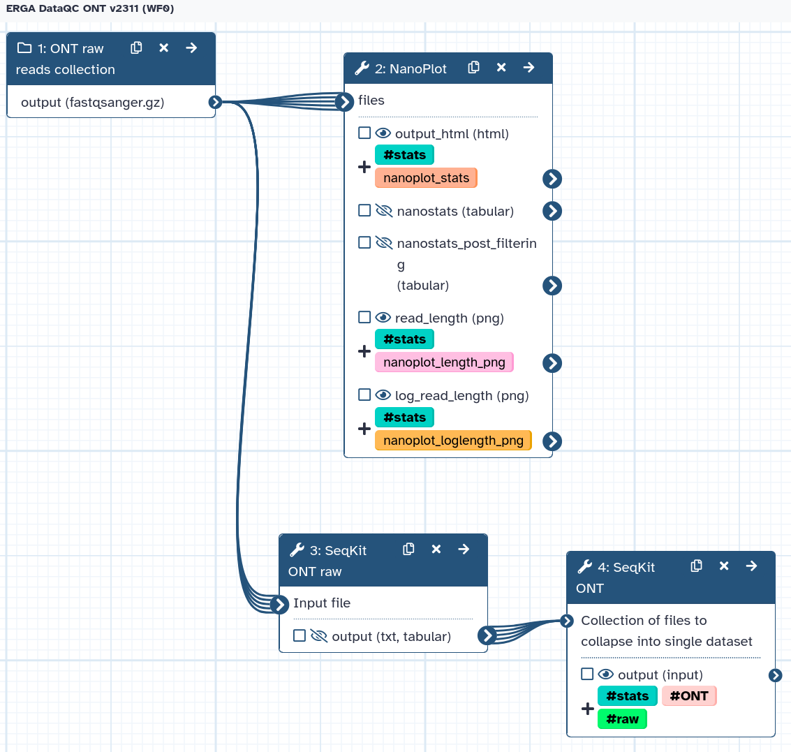

## Reads preprocessing & QC
Galaxy Workflows for checking quality and trimming/filtering reads from Illumina (WGS, HiC), PacBio HiFi and ONT.

Load the respective .ga file in Galaxy to run the workflow.

### Illumina Reads
The workflow takes a [paired-reads collection](https://training.galaxyproject.org/training-material/topics/galaxy-interface/tutorials/collections/tutorial.html), runs FastQC and SeqKit, trims with Fastp, and creates a MultiQC report. The main outputs are a paired collection of trimmed reads, a report with raw and trimmed reads stats, and a table with raw reads stats.

### HiFi Reads
The workflow takes a HiFi reads collection, runs FastQC and SeqKit, filters with Cutadapt, and creates a MultiQC report. The main outputs are a collection of filtred reads, a report with raw and filtered reads stats, and a table with raw reads stats.

### ONT Reads
The workflow takes ONT reads collection, runs SeqKit and Nanoplot. The main outputs are a table and plots of raw reads stats.

