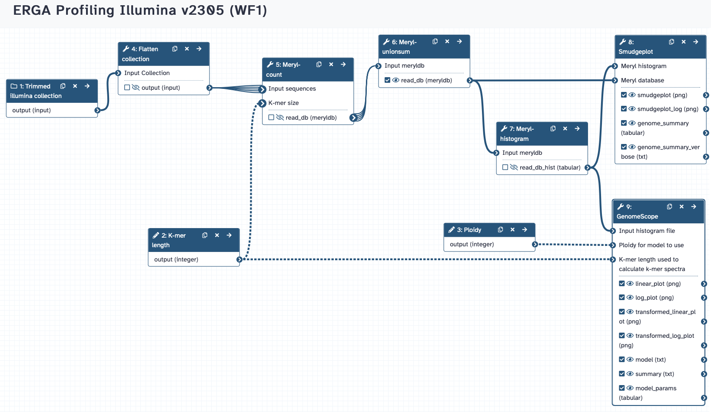

## Kmer-based Genome Profiling
Galaxy Workflows for checking properties of the genome (size, heterozygosity, ploidy) based on reads (Illumina, HiFi) k-mer profile.

Load the respective .ga file in Galaxy to run the workflow.

### Illumina Reads

### HiFi Reads
