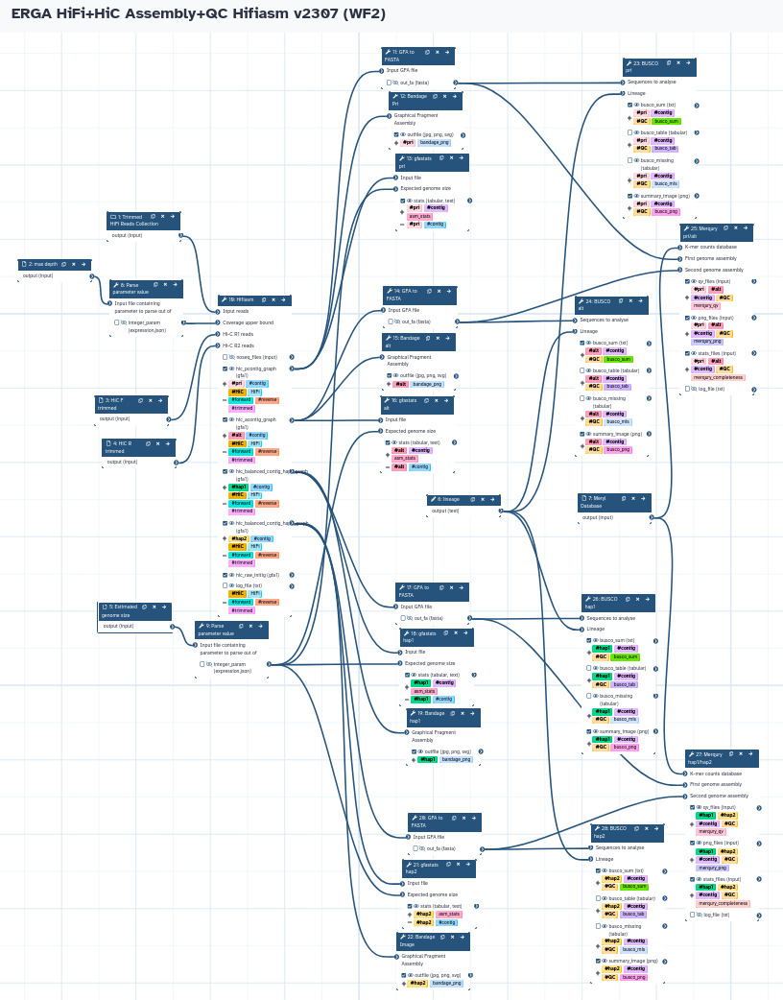

# Genome Assembly and QC
Galaxy Workflows for genome assembly and QC organised by the long reads technologies (HiFi or ONT) and programs.

Load the respective .ga file in Galaxy to run the workflow.

## HiFi-based assembly

### Hifiasm
The workflow takes a trimmed HiFi reads collection, Forward/Reverse HiC reads, and the max coverage depth (calculated from WF1) to run Hifiasm in HiC phasing mode. It produces both Pri/Alt and Hap1/Hap2 assemblies, and runs all the QC analysis (gfastats, BUSCO, and Merqury). The default Hifiasm purge level is Light (l1).

### Hicanu
\[in preparation]
### Flye
\[in preparation]
### Nextdenovo
\[in preparation]

## ONT-based assembly

### Flye
\[in preparation]
### Nextdenovo
\[in preparation]
### Shasta
\[in preparation]
