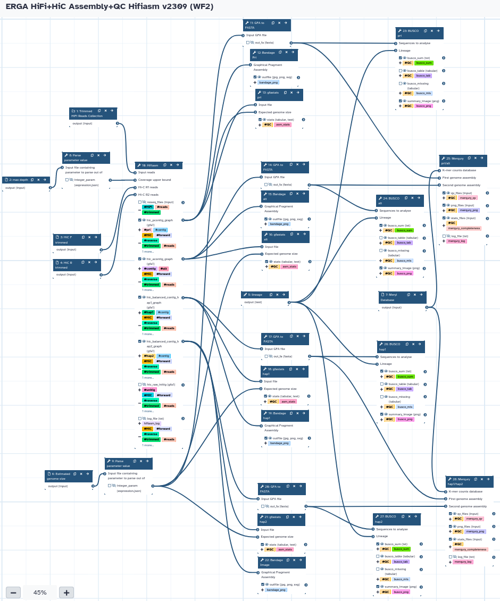
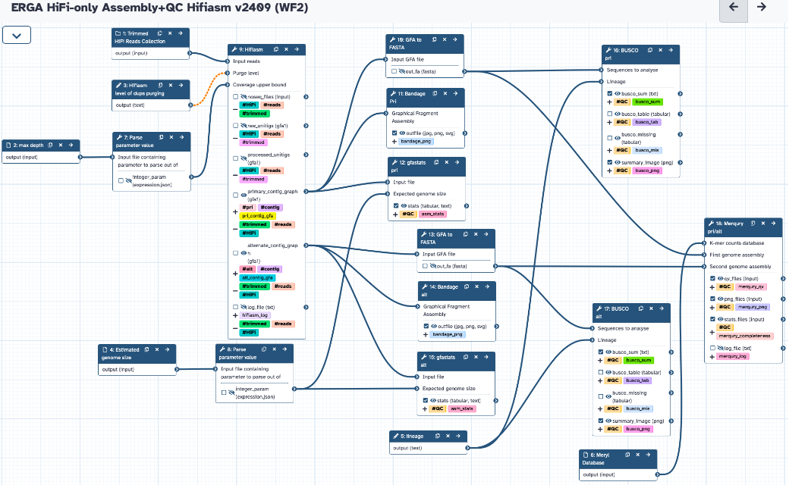
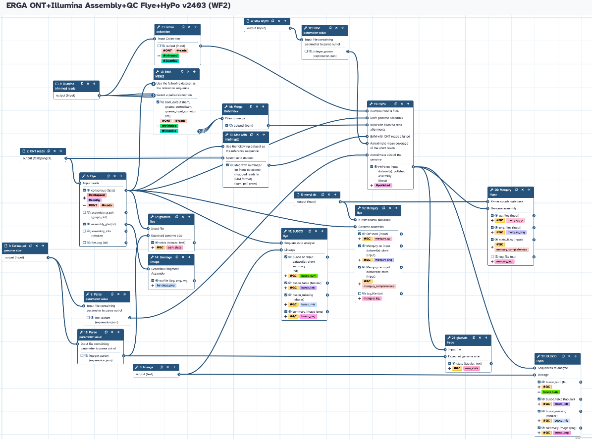
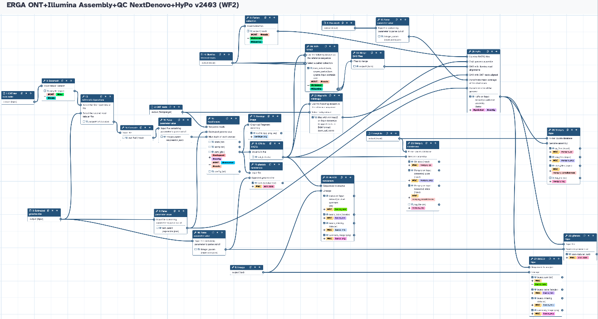

# Genome Assembly and QC
Galaxy Workflows for genome assembly and QC organised by the long reads technologies (HiFi or ONT) and programs.

Load the respective .ga file in Galaxy to run the workflow.

## HiFi-based assembly

### Hifiasm (HiFi & HiC)
The workflow takes a trimmed HiFi reads collection, Forward/Reverse HiC reads, and the max coverage depth (calculated from WF1) to run Hifiasm in HiC phasing mode. It produces both Pri/Alt and Hap1/Hap2 assemblies, and runs all the QC analysis (gfastats, BUSCO, and Merqury). The default Hifiasm purge level is Light (l1).

### Hifiasm (HiFi only)
The workflow takes a trimmed HiFi reads collection, and max coverage depth (calculated from WF1) to run Hifiasm in HiFi solo mode. It produces a Pri/Alt assembly, and runs all the QC analysis (gfastats, BUSCO, and Merqury).

## ONT-based assembly

### Flye
The workflow takes raw ONT reads and trimmed Illumina WGS paired reads collections, and the estimated genome size and Max depth (both calculated from WF1) to run Flye and subsequently polish the assembly with HyPo. It produces collapsed assemblies (unpolished and polished) and runs all the QC analyses (gfastats, BUSCO, and Merqury).

### Nextdenovo (untested)
The workflow takes raw ONT reads and trimmed Illumina WGS paired reads collections, the ONT raw stats table (calculated from WF1) and the estimated genome size (calculated from WF1) to run NextDenovo and subsequently polish the assembly with HyPo. It produces collapsed assemblies (unpolished and polished) and runs all the QC analyses (gfastats, BUSCO, and Merqury).

