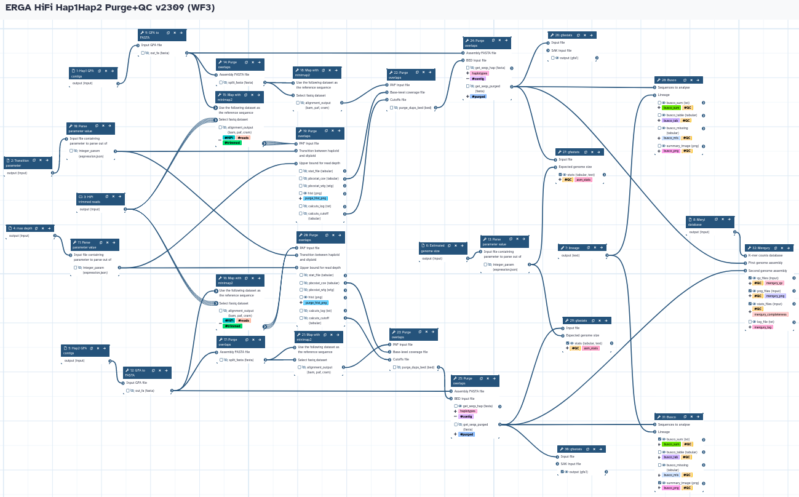
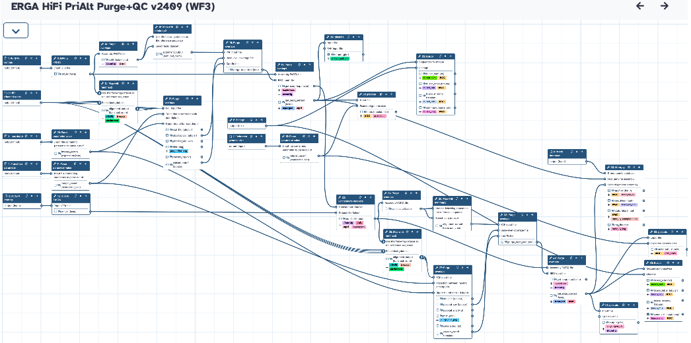
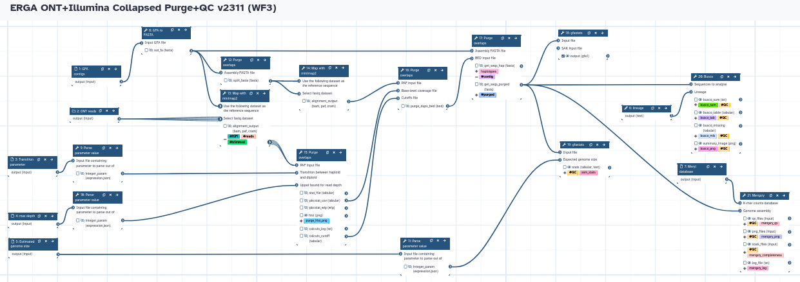

# Purge Haplotigs/Overlaps and QC
Galaxy Workflows for removing haplotigs and contig overlaps from assemblies based on read depth using Purge_Dups.

## Hap1/Hap2 assemblies
The workflow takes a trimmed HiFi reads collection, Hap1/Hap2 contigs, and the values for transition parameter and max coverage depth (calculated from WF1) to run Purge_Dups. It produces purged Hap1 and Hap2 contigs assemblies, and runs all the QC analysis (gfastats, BUSCO, and Merqury).

## Pri/Alt assemblies
The workflow takes a trimmed HiFi reads collection, Pri/Alt contigs, and the values for transition parameter and max coverage depth (calculated from WF1) to run Purge_Dups. It produces purged Pri and Alt contigs assemblies, and runs all the QC analysis (gfastats, BUSCO, and Merqury).

## Collapsed assemblies
The workflow takes a trimmed Illumina WGS paired-end reads collection, Collapsed contigs, and the values for transition parameter and max coverage depth (calculated from WF1) to run Purge_Dups. It produces purged Collapsed contigs assemblies, and runs all the QC analysis (gfastats, BUSCO, and Merqury).

