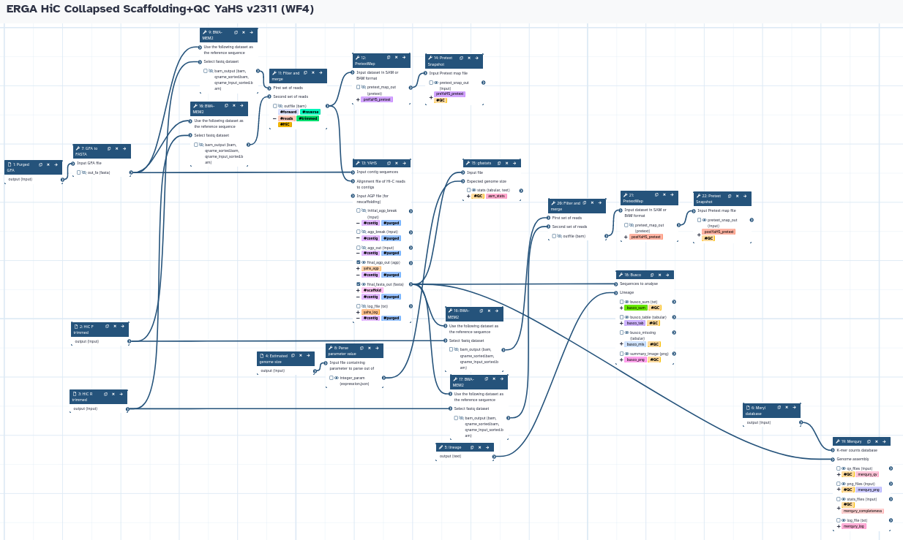

# Assembly Scaffolding and QC
Galaxy Workflows for scaffolding assemblies with HiC.

## Hap1/Hap2 assemblies
The workflow takes trimmed HiC forward and reverse reads, and Hap1/Hap2 assemblies to produce Hap1 and Hap2 scaffolded assemblies using YaHS. It also runs all the QC analyses (gfastats, BUSCO, and Merqury).

## One assembly (Hap1 or Pri or Collapsed)
The workflow takes trimmed HiC forward and reverse reads, and one assembly (e.g.: Hap1 or Pri or Collapsed) to produce a scaffolded assembly using YaHS. It also runs all the QC analyses (gfastats, BUSCO, and Merqury).

