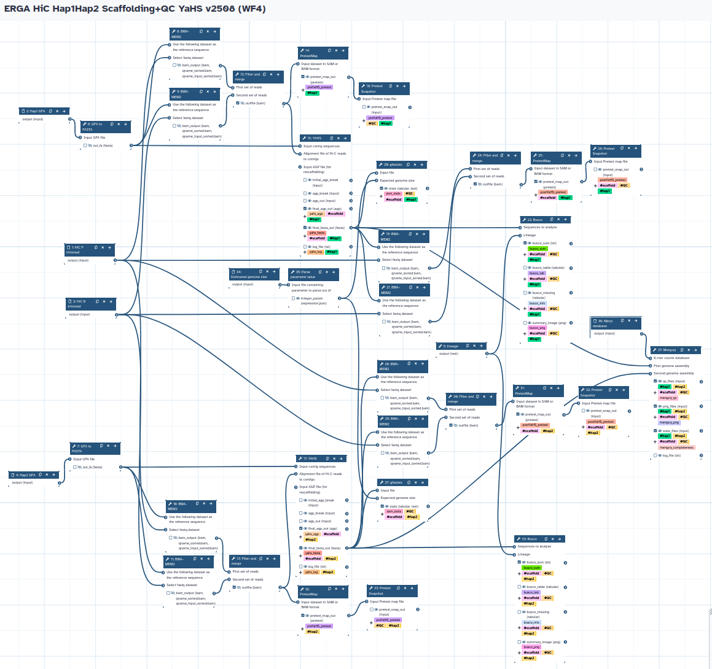

# Assembly Scaffolding and QC
Galaxy Workflows for scaffolding assemblies with HiC.

## Hap1/Hap2 assemblies
The workflow takes trimmed HiC forward and reverse reads, and Hap1/Hap2 assemblies to produce Hap1 and Hap2 scaffolded assemblies using YaHS. It also runs all the QC analyses (gfastats, BUSCO, and Merqury).

## Hap1 or Pri assemblies
\[in preparation]
