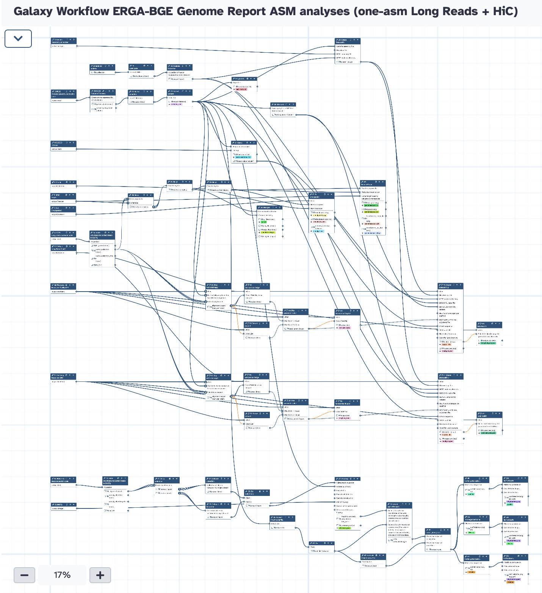
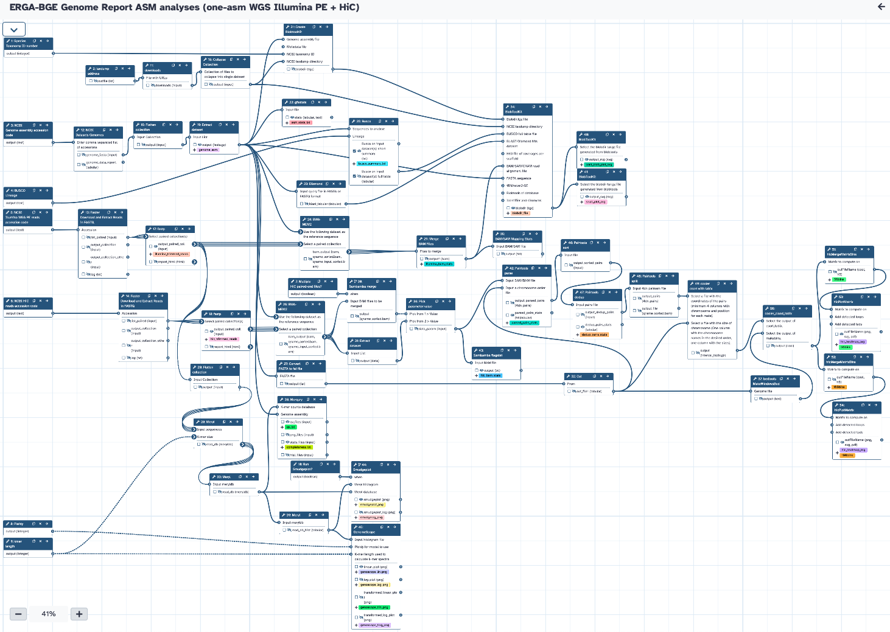

# Assembly Evaluation for ERGA-BGE Reports

The workflow requires the following:
- Species Taxonomy ID number
- NCBI Genome assembly accession code
- BUSCO Lineage
- WGS accurate reads accession code 
- NCBI HiC reads accession code

The workflow will get the data and process it to generate genome profiling (genomescope, smudgeplot -optional-), assembly stats (gfastats), merqury stats (QV, completeness), BUSCO, snailplot, contamination blobplot, and Hi-C heatmap.

## One Assmebly, Long Reads + HiC reads
Use this workflow for HiFi- or ONT-based assemblies.

## One Assmebly, Illumina WGS reads + HiC reads [TO UPDATE]
Use this workflow for ONT-based assemblies where the WGS accurate reads are Illumina PE

